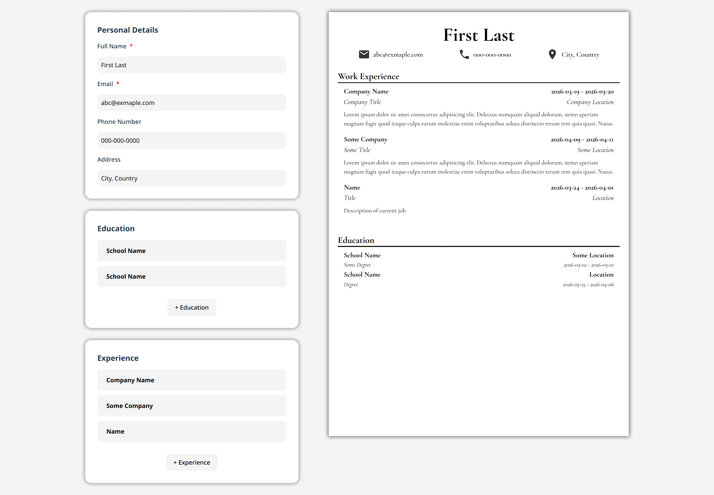
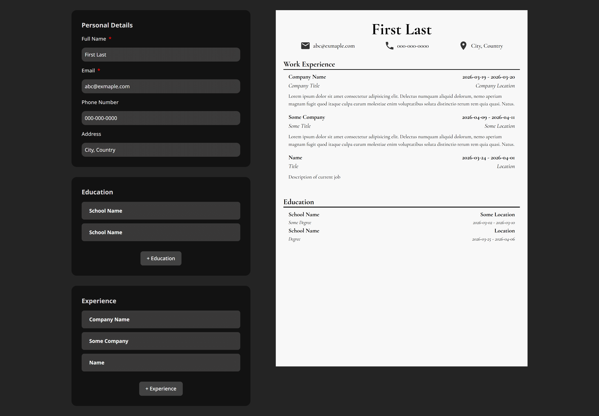

# 📝 CV Builder Using React

A dynamic CV application built with React that allows users to input their general information, educational background, and practical experience. This project demonstrates core React concepts like functional components, props, and state management.

## 🚀 Live Demo

[View the Live Site on Cloudflare Pages](https://cv-application-643.pages.dev/)

## ✨ Features

- **Modular Sections:** Dedicated components for General Info, Education, and Practical Experience.
- **Toggle Edit/Submit:** Seamlessly switch between form-entry and preview modes using React state.
- **Dynamic Updates:** Edited values are instantly reflected in the CV preview without page reloads.

## 🛠️ Tech Stack

- Semantic HTML5
- CSS
- React.js + Vite

## What I learned

- React Fundamentals
- Creating a react app with Vite
- Function components and Hooks
- Controlling inputs and rendering lists in react
- Managing state in react
- Deploying a site with a PaaS like [Cloudflare Pages](https://pages.cloudflare.com/).

## Features to Add

- Allow user's to save the generated CV in a pdf format
- Add Skills section
- Form Validation
- Responsiveness
